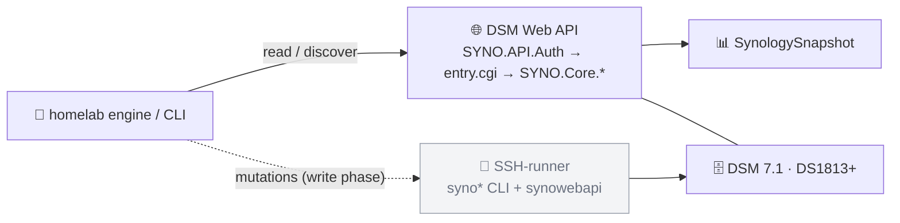

# SynoSharp

[](https://www.nuget.org/packages/Chrison.SynoSharp/)
[](https://www.nuget.org/packages/Chrison.SynoSharp/)
[](https://github.com/Chrison-dev/SynoSharp/actions/workflows/ci.yml)
[](https://github.com/Fallout-build/Fallout)
[](LICENSE)

A C# client for **Synology DSM** IaC. Sibling to ProxmoxSharp/UnifiSharp — but
**not code-generated**: Synology publishes no settings/deploy API schema, so per
[ADR-0002](https://github.com/Chrison-Homelab/Homelab/blob/main/docs/adr/ADR-0002-synosharp.md)
this is a hand-written **read-API client** (now) + an **SSH-runner** for mutations (later).

```sh
dotnet add package Chrison.SynoSharp
```



## Approach

- **Read / discover** → the DSM **Web API** (`SYNO.API.Auth` → `entry.cgi` →
  `SYNO.Core.*`), returning a structured `SynologySnapshot`. *(This repo.)*
- **Mutations** (shares, NFS, users, network) → an **SSH-runner** over the on-box
  `syno*` CLI + `synowebapi` (added with the write phase). The `SYNO.Core.*`
  endpoints are undocumented/version-fragile — pinned to **DSM 7.1** (the DS1813+
  is EOL there).

## Projects

| Project | What |
| --- | --- |
| `src/SynoSharp/` | The client — `SynologyApiClient` (Web-API read), `SynologyDiscovery` → `SynologySnapshot`, `Ssh/` (the SSH-runner), `Tools/` (typed `synoshare`/`synouser`/`synogroup` wrappers), `Provisioning/` (specs + reconciler). SemVer. |
| `src/SynoSharp.Cli/` | `synosharp` dotnet tool — `discover`, `ssh-check`, `plan`, `apply`. |
| `tests/SynoSharp.Tests/` | Unit (quoting + reconciler) + skippable live tests (Web-API + SSH). |

## Build / use

Built with [Fallout](https://github.com/Fallout-build/Fallout) (Chris's C#/.NET
build system, a NUKE successor). Requires the .NET 10 SDK and `GITHUB_PACKAGES_PAT`
(a PAT with `read:packages` on the Fallout-build org — restores `Fallout.*`, see `nuget.config`).

```bash
./build.sh              # default: Test (Compile + Test); ./build.sh Pack → Chrison.* nupkgs
export SYNOLOGY_BASE_URL=https://nas:5001 SYNOLOGY_USER=… SYNOLOGY_PASSWORD=… SYNOLOGY_VERIFY_TLS=false
synosharp discover     # JSON snapshot: model, serial, DSM version, shares, users
synosharp ssh-check    # prove the SSH-runner: login + sudo-to-root + read-only `synoshare --enum`
```

The SSH-runner reuses `SYNOLOGY_USER`/`SYNOLOGY_PASSWORD` (the account also supplies
the `sudo` password — `syno*` need root) and derives the host from `SYNOLOGY_BASE_URL`;
override with `SYNOLOGY_SSH_HOST`/`SYNOLOGY_SSH_PORT`/`SYNOLOGY_SSH_KEY`. DSM 7 disables
direct root SSH, so the runner logs in as an admin user and `sudo -S` (password over
stdin, never in the command line), running tools through `env PATH=/usr/syno/sbin:…`
since sudo's `secure_path` excludes the syno dirs.

Packages publish to **nuget.org** (public) under the `Chrison.*` prefix
(`Chrison.SynoSharp`, `Chrison.SynoSharp.Cli`) via **Trusted Publishing** (OIDC — no
stored key), like the siblings: prerelease on push to `main`, stable on `v*` tag.
Assembly name/namespace stay `SynoSharp`, so `using SynoSharp;` is unchanged.

## Status

**Read/discover — verified against the live NAS (2026-05-31, DS1813+ / DSM
7.1.1-42962).** `discover` returns model, serial, DSM version, share names and
user names (`SYNO.Core.System` / `Share` / `User`). The `SYNO.Core.*` reads are
defensive (degrade to empty on shape mismatch).

**SSH-runner transport — verified against the live NAS (2026-05-31).** `ssh-check`
proves the full stack end-to-end (SSH login → sudo-to-root → on-box `syno*`):
`synoshare --enum ALL` lists the live shares with **zero mutation**. The runner
(`ISshRunner`/`SshRunner` over SSH.NET) + structured `SynologyCommand` (shell-quoted
argv) are the transport for the write path.

**Write path (Phase A) — reconciler for shares/users/groups, dry-run by default.**
Desired-state specs (`ShareSpec`/`UserSpec`/`GroupSpec`) are diffed against live
state by `SynologyReconciler` → a `SynologyPlan` of create/delete/skip actions; each
carries the exact `synoshare`/`synouser`/`synogroup` command. `ApplyAsync(apply:false)`
is a dry-run (the default). **Verified against the live NAS (2026-05-31):** `plan`
correctly skipped existing resources, planned creates for new ones, and blocked a
passwordless user create — **zero mutation** (reads only).

```bash
synosharp plan  spec.json              # diff vs live → dry-run plan (read-only)
synosharp apply spec.json              # still a dry-run…
synosharp apply spec.json --confirm    # …only this mutates
```

The reconciler does **existence + field reconciliation**: create-if-missing /
delete-if-`present:false` / **modify-on-drift** / skip-if-in-sync, and **never
prunes** unmanaged resources. Field drift is checked for share/group `Description`
and user `FullName`/`Email` (read via `--get`/`--descget`, set via
`--setdesc`/`--descset`/`--modify`); **empty/null spec fields are unmanaged** (never
clobbered), and `expired` is preserved. Share deletes **keep data by default** (DSM
shares are btrfs subvolumes); set `ShareSpec.DeleteData = true` for a destructive
`synoshare --del TRUE`. **Next:** list-valued fields (share ACLs, group membership),
then NFS exports via `synowebapi` — last, highest-risk, prove on Virtual DSM
(needs an x86/KVM host).
See the [write-path plan](https://github.com/chrison-dev/Homelab/blob/main/docs/plans/057-synosharp-write-path.md).
